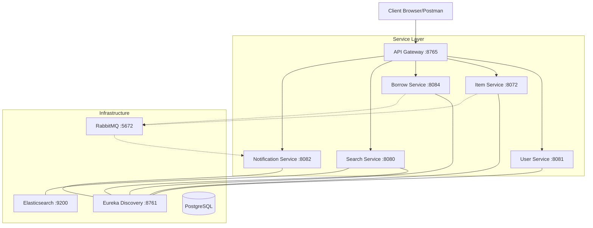

# msc_eLib - E-Library Microservices System

A robust, scalable E-Library management system built using Spring Boot Microservices architecture.

## Architecture Overview

The system consists of several microservices coordinated through a service discovery server and accessed via a unified API Gateway.



## Technology Stack

- **Core**: Java 21, Spring Boot 3.x
- **Infrastructure**:
  - **Discovery**: Netflix Eureka
  - **Gateway**: Spring Cloud Gateway
  - **Circuit Breaker**: Resilience4j
- **Storage**:
  - **Persistence**: PostgreSQL (multiple databases)
  - **Search**: Elasticsearch
  - **Caching**: Caffeine
- **Messaging**: RabbitMQ
- **Communication**: REST API (Synchronous), AMQP (Asynchronous)
- **Security**: JWT (custom), Google OAuth2

## API Reference

The unified entry point is the **API Gateway** at `http://localhost:8765`.

### 1. User Service (`/api/v1/users`)
Handles registration, authentication, and profile management.

| Method | Endpoint | Description |
| :--- | :--- | :--- |
| `POST` | `/register` | Register a new user account |
| `POST` | `/login` | Login and receive JWT access token |
| `GET` | `/me` | Get profile information of the authenticated user |
| `PUT` | `/edit-profile` | Update user profile details |
| `GET` | `/{id}` | Retrieve user details by UUID |
| `GET` | `/` | **Admin:** List all registered users |
| `DELETE` | `/{id}` | **Admin:** Remove a user account |
| `POST` | `/jwt/parse` | Internal utility to parse token data |

### 2. Item Service (`/api/v1/item`)
Manages the library catalog and inventory levels.

| Method | Endpoint | Description |
| :--- | :--- | :--- |
| `GET` | `/` | List all available items in the system |
| `GET` | `/{id}` | Get specific item details by ID |
| `GET` | `/title?title={t}` | Find item by exact title match |
| `GET` | `/isbn?isbn={i}` | Find item by ISBN |
| `GET` | `/search?keyword={k}` | Basic keyword search |
| `POST` | `/` | Add a new item to the library |
| `PUT` | `/{id}` | Update existing item metadata |
| `DELETE` | `/{id}` | Remove an item from the catalog |
| `PATCH` | `/{id}/increase?quantity={n}` | Add stock to inventory |
| `PATCH` | `/{id}/decrease?quantity={n}` | Reduce inventory count |

### 3. Borrow Service (`/api/v1/borrows`)
Manages the lifecycle of borrowing transactions.

| Method | Endpoint | Description |
| :--- | :--- | :--- |
| `POST` | `/` | Borrow an item (requires stock) |
| `GET` | `/` | View all borrow records |
| `GET` | `/{id}` | Get specific borrow details |
| `PATCH` | `/{id}/return` | Return a borrowed item |
| `GET` | `/users/{userId}` | Get borrowing history for a user |
| `GET` | `/users/{userId}/overdue` | List overdue items for a user |
| `GET` | `/users/{userId}/underdue` | View active non-overdue borrows |
| `GET` | `/users/{userId}/credit` | Retrieve user credit score |
| `GET` | `/available/{itemId}` | Check if item can be borrowed |

**Waitlist Endpoints (`/api/v1/waitlist`)**
| Method | Endpoint | Description |
| :--- | :--- | :--- |
| `POST` | `/` | Join waiting list for an out-of-stock item |
| `GET` | `/{userId}` | View user's waitlist placement |
| `DELETE` | `/{id}` | Remove user from waitlist |

### 4. Search Service (`/api/v1/search`)
Advanced catalog search backed by Elasticsearch.

| Method | Endpoint | Description |
| :--- | :--- | :--- |
| `GET` | `/` | Advanced search with filters (keyword, formats, genres, ages, language) |

### 5. Notification Service (`/api/v1/notifications`)
User notification management.

| Method | Endpoint | Description |
| :--- | :--- | :--- |
| `GET` | `/users/{userId}` | List all notifications for a user (most recent first) |
| `PATCH` | `/users/{userId}/read-all` | Mark all notifications as read |

## Setup and Running

1. **Prerequisites**: Docker and Docker Compose installed.
2. **Build and Start**:
   ```bash
   docker compose up -d --build
   ```
3. **Access Services**:
   - Central Gateway: `http://localhost:8765`
   - Eureka Dashboard: `http://localhost:8761`
   - RabbitMQ Management: `http://localhost:15672` (admin/admin123)
   - H2 Console (Notification Service): `http://localhost:8082/h2-console`
