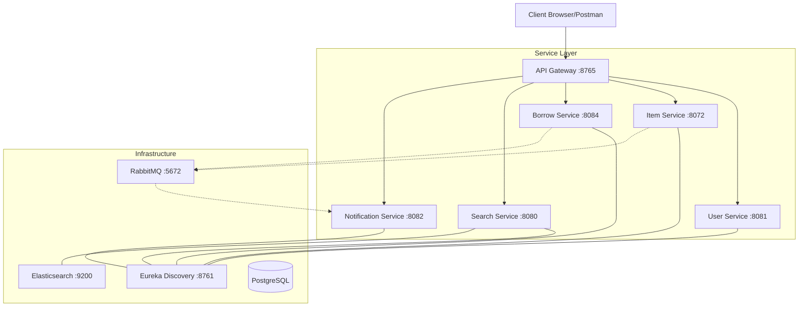

# msc_eLib - E-Library Microservices System

A robust, scalable E-Library management system built using Spring Boot Microservices architecture.

## Architecture Overview

The system consists of several microservices coordinated through a service discovery server and accessed via a unified API Gateway.


```mermaid
graph TD
    Client[Client Browser/Postman] --> Gateway[API Gateway :8765]
    
    subgraph "Service Layer"
        Gateway --> UserService[User Service :8081]
        Gateway --> ItemService[Item Service :8072]
        Gateway --> BorrowService[Borrow Service :8084]
        Gateway --> SearchService[Search Service :8080]
        Gateway --> NotificationService[Notification Service :8082]
    end
    
    subgraph "Infrastructure"
        Discovery[Eureka Discovery :8761]
        RabbitMQ[RabbitMQ :5672]
        ES[Elasticsearch :9200]
        Postgres[(PostgreSQL)]
    end
    
    UserService --- Discovery
    ItemService --- Discovery
    BorrowService --- Discovery
    SearchService --- Discovery
    NotificationService --- Discovery
    
    ItemService -.-> RabbitMQ
    BorrowService -.-> RabbitMQ
    RabbitMQ -.-> NotificationService
    
    SearchService --- ES
```

## Technology Stack

- **Core**: Java 21, Spring Boot 3.x
- **Infrastructure**:
  - **Discovery**: Netflix Eureka
  - **Gateway**: Spring Cloud Gateway
  - **Circuit Breaker**: Resilience4j
- **Storage**:
  - **Persistence**: PostgreSQL (multiple databases)
  - **Search**: Elasticsearch
  - **Caching**: Caffeine
- **Messaging**: RabbitMQ
- **Communication**: REST API (Synchronous), AMQP (Asynchronous)
- **Security**: JWT (custom), Google OAuth2

## API Reference

The unified entry point is the **API Gateway** at `http://localhost:8765`.

### 1. User Service (`/api/v1/users`)
Handles registration, authentication, and profile management.

| Method | Endpoint | Description |
| :--- | :--- | :--- |
| `POST` | `/register` | Register a new user account |
| `POST` | `/login` | Login and receive JWT access token |
| `GET` | `/me` | Get profile information of the authenticated user |
| `PUT` | `/edit-profile` | Update user profile details |
| `GET` | `/{id}` | Retrieve user details by UUID |
| `GET` | `/` | **Admin:** List all registered users |
| `DELETE` | `/{id}` | **Admin:** Remove a user account |
| `POST` | `/jwt/parse` | Internal utility to parse token data |

### 2. Item Service (`/api/v1/item`)
Manages the library catalog and inventory levels.

| Method | Endpoint | Description |
| :--- | :--- | :--- |
| `GET` | `/` | List all available items in the system |
| `GET` | `/{id}` | Get specific item details by ID |
| `GET` | `/title?title={t}` | Find item by exact title match |
| `GET` | `/isbn?isbn={i}` | Find item by ISBN |
| `GET` | `/search?keyword={k}` | Basic keyword search |
| `POST` | `/` | Add a new item to the library |
| `PUT` | `/{id}` | Update existing item metadata |
| `DELETE` | `/{id}` | Remove an item from the catalog |
| `PATCH` | `/{id}/increase?quantity={n}` | Add stock to inventory |
| `PATCH` | `/{id}/decrease?quantity={n}` | Reduce inventory count |

### 3. Borrow Service (`/api/v1/borrows`)
Manages the lifecycle of borrowing transactions.

| Method | Endpoint | Description |
| :--- | :--- | :--- |
| `POST` | `/` | Borrow an item (requires stock) |
| `GET` | `/` | View all borrow records |
| `GET` | `/{id}` | Get specific borrow details |
| `PATCH` | `/{id}/return` | Return a borrowed item |
| `GET` | `/users/{userId}` | Get borrowing history for a user |
| `GET` | `/users/{userId}/overdue` | List overdue items for a user |
| `GET` | `/users/{userId}/underdue` | View active non-overdue borrows |
| `GET` | `/users/{userId}/credit` | Retrieve user credit score |
| `GET` | `/available/{itemId}` | Check if item can be borrowed |

**Waitlist Endpoints (`/api/v1/waitlist`)**
| Method | Endpoint | Description |
| :--- | :--- | :--- |
| `POST` | `/` | Join waiting list for an out-of-stock item |
| `GET` | `/{userId}` | View user's waitlist placement |
| `DELETE` | `/{id}` | Remove user from waitlist |

### 4. Search Service (`/api/v1/search`)
Advanced catalog search backed by Elasticsearch.

| Method | Endpoint | Description |
| :--- | :--- | :--- |
| `GET` | `/` | Advanced search with filters (keyword, formats, genres, ages, language) |

### 5. Notification Service (`/api/v1/notifications`)
User notification management.

| Method | Endpoint | Description |
| :--- | :--- | :--- |
| `GET` | `/users/{userId}` | List all notifications for a user (most recent first) |
| `PATCH` | `/users/{userId}/read-all` | Mark all notifications as read |

## Setup and Running

1. **Prerequisites**: Docker and Docker Compose installed.
2. **Build and Start**:
   ```bash
   docker compose up -d --build
   ```
3. **Access Services**:
   - Central Gateway: `http://localhost:8765`
   - Eureka Dashboard: `http://localhost:8761`
   - RabbitMQ Management: `http://localhost:15672` (admin/admin123)
   - H2 Console (Notification Service): `http://localhost:8082/h2-console`

---

## Code Documentation

The System relies on a central Spring API Gateway for external routing and Netflix Eureka for internal service discovery.

### 1. Core Domain Services

Our domain is divided into five core services. These define the long-term business boundaries of our application.

- **User Service (:8081):** Manages the authentication lifecycle (Custom JWT / Google OAuth2) and user profiles.
- **Item Service (:8072):** The system of record for the library catalogue. Manages inventory levels and book metadata.
- **Borrow Service (:8084):** Handles the core transactional logic of borrowing and returning items. Calculates credit scores, manages waitlists, and enforces critical business rules.
- **Search Service (:8080):** Provides advanced faceted search capabilities, leveraging an Elasticsearch index for high performance.
- **Notification Service (:8082):** Asynchronously consumes events from RabbitMQ to alert users about system events.

### 2. Communication Pattern

We used RabbitMQ for cross-service communication that does not require an immediate synchronous response. For direct communication between services, we used HTTP calls.

### 3. Developer: Where to Start

To get started with the development, we need a local environment capable of running containerized services.

#### 3.1. Prerequisites

- Docker and Docker Compose
- Java 21 and Maven (for local service debugging and builds)
- An IDE with Spring Boot and Lombok plugin support

#### 3.2. Local Setup Instructions

We used Docker Compose to orchestrate our infrastructure and services for local development, providing a clear and clean infrastructure-as-code solution.

**Clone and Build:**
```bash
git clone <repository-url>
cd msc_eLib
docker compose up -d --build
```

**Verify Infrastructure:**
- Eureka Dashboard: `http://localhost:8761` (Verify all 5 core services are registered)
- API Gateway: `http://localhost:8765` (All frontend/client API calls should route through here)
- RabbitMQ Management: `http://localhost:15672` (Credentials: admin / admin123)

### 4. Architectural Boundaries and APIs

All external communications must route through the API Gateway at `/api/v1/*`. For example, when a user attempts to borrow a book, the following interaction occurs:

1. Client sends `POST /api/v1/borrows/` to the API Gateway.
2. Gateway routes the request to the BorrowService.
3. BorrowService makes a synchronous REST call to ItemService to verify real-time stock availability.
4. If available, BorrowService deducts the stock (via ItemService), creates a transaction, and updates the user's borrowed list.

For detailed endpoint specifications, refer to the individual Swagger documentation exposed by each service at runtime.

### 5. Software Design Patterns

The msc_eLib leverages several industry-standard software design patterns across its microservices to ensure code maintainability, scalability, and resilience.

#### 5.1. System-Wide Patterns

- **API Gateway Pattern:** Implemented using Spring Cloud Gateway to provide a unified entry point, handle routing, and encapsulate internal service topology.
- **Service Registry Pattern:** Netflix Eureka is used for dynamic service registration and discovery, avoiding hard-coded IP addresses.
- **Event-Driven (Publisher-Subscriber) Pattern:** Used heavily with RabbitMQ to decouple services. For example, ItemService and BorrowService publish events that SearchService and NotificationService consume.

#### 5.2. Service-Level Patterns

- **Layered Architecture (MVC) Pattern:** Every service strictly separates concerns into Controllers (API layer), Services (Business logic), and Repositories (Data Access layer).
- **Data Transfer Object (DTO) Pattern:** DTOs are used in all services (e.g., `UserDTO`, `AuthResponseDTO`) to isolate internal database entities from external API contracts.
- **Data Mapper Pattern:** Custom mapper classes (like `UserMapper.java`) translate between DTOs and Entities.
- **Repository / DAO Pattern:** Spring Data JPA `JpaRepository` interfaces abstract the underlying database operations (e.g., `UserRepository`, `ItemRepository`).
- **Circuit Breaker Pattern:** Resilience4j (`@CircuitBreaker`) is implemented on synchronous inter-service calls (e.g., in BorrowService and UserService) to prevent cascading failures if a downstream service goes offline.
- **Builder Pattern:** Lombok's `@Builder` annotation is used extensively across Entities and DTOs to provide a flexible and readable way to construct complex objects.

#### 5.3. Service-Level Design Patterns

- **Strategy Pattern:** Implemented in the NotificationService to manage multiple delivery channels. The `NotificationSender` interface defines the strategy, while concrete classes like `EmailSender`, `SMSSender`, and `InAppNotifier` encapsulate the specific implementation details for each communication channel. This allows the system to send notifications through different providers without modifying the core dispatching logic.

- **Factory Pattern:** A `ChannelStrategyFactory` is used in the NotificationService to dynamically select and provide the appropriate list of notification strategies. It evaluates the user's personal `UserPreferences` at runtime to determine which active channels (e.g., Email, SMS) should be utilized for a specific event.

- **Observer Pattern:** The notification service acts as a specialized observer within the system. It asynchronously listens for various domain events (e.g., `UserRegisterEvent`, `BorrowEvent`) published to RabbitMQ exchanges, allowing it to react and trigger notifications without imposing latency on the originating services.

### 6. Development Standards

When adding new features, modifying business rule logic, and expanding the system, follow the standards mentioned below.

- **Auto-Generated API Docs:** Swagger will automatically detect and expose the endpoints.
- **Automated Testing:** Ensure integration tests cover new endpoints. Use Testcontainers to start isolated PostgreSQL and RabbitMQ instances for reliable, containerized test execution.
- **Database Migrations:** Never modify existing database schemas manually. Always create a new database migration script to make sure changes are trackable and reproducible across environments.
